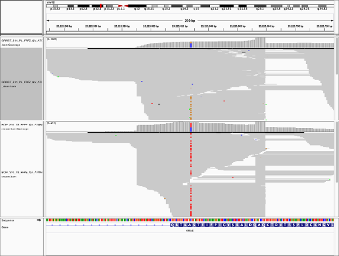

# vcfPCRoffset
Tests a vcf file for unbalanced PCR templates

## Introduction

This is a lightweight script test each mutation in a vcf file for PCR imbalance and is intended mainly for library prep techniques involving PCR.
A well balanced set of PCR templates will all have mutant and reference alleles in more or less the same proportions. However this is not always the case. There are a number of reasons why templates might be unbalanced. The primers might preferentially amplify (or miss) specific variants. Aligners might mis-align specific reads from this region elsewhere, or reads from elsewhere to this region. One option to investigate this is to visually inspect reads using a tool such as IGV, where unbalanced reads can be obvious.


*Sample IGV plot of mutations calls with offset (top) and balanced (bottom) PCR templates

The top image is a mutation which only appears in a subset of reads when viewed by template position, so is clearly imbalanced. The bottom image has mutant alleles spread throughout the templates in a balanced fashion. This is fine if you are only checking a few mutations, but can be difficult as the numbers increase.
This tool is a quick way to test for this PCR offset within a vcf file, if the original bam file is available. It creates a copy of the original vcf file, with additional fields to indicate the proportion of reads which are unbalanced, according to a simple binomial test.

## Installation and requirements

vcfPCRoffset requires python3, with the numpy and pysam modules installed. We leave it up to the user to install these as they see fit, either with pip, conda or other means.
No installation is required, just download the vcfPCRoffset.py python script manually, or by:
```
wget https://github.com/omicsForestry/vcfPCRoffset/scripts/vcfPCRoffset.py
```
None of the rest of this repository is needed. You can make it executable or add to your path if you want, or just use it as is.


## Usage
```
usage: vcfPCRoffset.py [-h] -i INPUT -o OUTPUT -b BAM [-r REFTAG] [-v VARTAG] [-x REFVARTAG] [-y VARREFTAG] [-f FILTER] [-t]

Go through vcf and bam files together, reporting PCR template offsets.

options:
  -h, --help            show this help message and exit
  -i INPUT, --input INPUT
                        Input vcf file
  -o OUTPUT, --output OUTPUT
                        Output vcf file
  -b BAM, --bam BAM     Bam file to check for PCR site discrepancies
  -r REFTAG, --refTag REFTAG
                        Reference depth tag in vcf if not the default RD
  -v VARTAG, --varTag VARTAG
                        Variant depth tag in vcf if not the default AD
  -x REFVARTAG, --refVarTag REFVARTAG
                        Reference/Variant depth tag in vcf if stored in single REF,VAR format
  -y VARREFTAG, --varRefTag VARREFTAG
                        Variant/Reference depth tag in vcf if stored in single VAR,REF format
  -f FILTER, --filter FILTER
                        Threshold to filter variant records
  -t, --tabix           Compress input file and make tabix index
```


# Required arguments

The `input` option specifies the vcf file to test. The tags produced by varscan2 are expected, but other formats can be specified with optional arguments

The `output` option specifies the path to a new output vcf file to create. This will match the format of the `input` file but with additional fields `ROR` and `ROV` to indicate the proportion of offset reads.

The `bam` option specifies the path to the bam file used to create the `input` vcf file

# Optional arguments

The `refTag` option can be used if the vcf format specifies reference depth with a tag other than `RD`

The `varTag` option can be used if the vcf format specifies variant depth with a tag other than `AD`

The `refVarTag` option is used if the vcf format stores reference and variant depth together, eg: `XYZ = REF,VAR`

The `varRefTag` option is used if the vcf format stores variant and reference depth together, eg: `XYZ = VAR,REF`

The `filter` option is used to provide a threshold to change the `FILTER` field of the vcf file, adding a filter called `PCR_bias` if either the variant or reference template reads in proportions exceeding this threshold

The `tabix` option is used to compress and index the input vcf file, if not already done. The input vcf and bam files are tested for indexing. The `tabix` option is only needed if the input vcf is uncompressed, as compression might make it unusable for other tools. If this is likely to be the case, then making a copy is recommended. Tabix indexing of compressed vcf files and bam indexing is automatically performed, if needed.


## Example usage
We provide two example files `example.bam` and `test.vcf`. To analyse these.

```python vcfPCRoffset.py -i test.vcf -b example.bam -o res.vcf```

This will not perform any analysis, as the input files are not indexed or compressed:

```
The input vcf is unzipped and unindexed - use the --tabix option to compress and index it.
***WARNING*** If you need the unzipped veriosn, make a copy.
```

Repeating with the `tabix` option will allow analysis to proceed:
```python vcfPCRoffset.py -i test.vcf -b example.bam -o res.vcf -t```

This will add two fields to the vcf file. The mutations were:
```
#CHROM  POS     ID      REF     ALT     QUAL    FILTER  INFO    FORMAT  Sample1
chr1    97515839        .       T       C       .       PASS    ADP=605;WT=0;HET=1;HOM=0;NC=0   GT:GQ:SDP:DP:RD:AD:FREQ:PVAL:RBQ:ABQ:RDF:RDR:ADF:ADR        0/1:255:605:605:308:294:48.6%:3.8153E-110:77:76:156:152:151:143
chr1    114709799       .       C       T       .       PASS    ADP=46;WT=0;HET=1;HOM=0;NC=0    GT:GQ:SDP:DP:RD:AD:FREQ:PVAL:RBQ:ABQ:RDF:RDR:ADF:ADR        0/1:22:46:46:39:7:15.22%:6.1097E-3:39:36:0:39:0:7
chr1    114709804       .       T       C       .       PASS    ADP=45;WT=0;HET=1;HOM=0;NC=0    GT:GQ:SDP:DP:RD:AD:FREQ:PVAL:RBQ:ABQ:RDF:RDR:ADF:ADR        0/1:29:45:45:35:9:20%:1.2408E-3:40:18:0:35:0:9
chr3    179199217       .       A       G       .       PASS    ADP=32;WT=0;HET=1;HOM=0;NC=0    GT:GQ:SDP:DP:RD:AD:FREQ:PVAL:RBQ:ABQ:RDF:RDR:ADF:ADR        0/1:54:32:32:17:15:46.88%:3.5464E-6:38:18:0:17:0:15
chr3    179203851       .       C       A       .       PASS    ADP=162;WT=0;HET=1;HOM=0;NC=0   GT:GQ:SDP:DP:RD:AD:FREQ:PVAL:RBQ:ABQ:RDF:RDR:ADF:ADR        0/1:177:162:162:110:52:32.1%:1.6611E-18:69:42:54:56:22:30
chr3    179204486       .       C       A       .       PASS    ADP=331;WT=0;HET=1;HOM=0;NC=0   GT:GQ:SDP:DP:RD:AD:FREQ:PVAL:RBQ:ABQ:RDF:RDR:ADF:ADR        0/1:125:333:331:290:40:12.08%:2.5852E-13:62:43:116:174:17:23
```

And now they are:
```
#CHROM	POS	ID	REF	ALT	QUAL	FILTER	INFO	FORMAT	Sample1
chr1	97515839	.	T	C	.	PASS	ADP=605;WT=0;HET=1;HOM=0;NC=0	GT:GQ:SDP:DP:RD:AD:FREQ:PVAL:RBQ:ABQ:RDF:RDR:ADF:ADR:ROR:ROV	0/1:255:605:605:308:294:48.6%:3.8153E-110:77:76:156:152:151:143:0.0413:0.1281
chr1	114709799	.	C	T	.	PASS	ADP=46;WT=0;HET=1;HOM=0;NC=0	GT:GQ:SDP:DP:RD:AD:FREQ:PVAL:RBQ:ABQ:RDF:RDR:ADF:ADR:ROR:ROV	0/1:22:46:46:39:7:15.22%:6.1097E-3:39:36:0:39:0:7:0:0
chr1	114709804	.	T	C	.	PASS	ADP=45;WT=0;HET=1;HOM=0;NC=0	GT:GQ:SDP:DP:RD:AD:FREQ:PVAL:RBQ:ABQ:RDF:RDR:ADF:ADR:ROR:ROV	0/1:29:45:45:35:9:20%:1.2408E-3:40:18:0:35:0:9:0:0
chr3	179199217	.	A	G	.	PASS	ADP=32;WT=0;HET=1;HOM=0;NC=0	GT:GQ:SDP:DP:RD:AD:FREQ:PVAL:RBQ:ABQ:RDF:RDR:ADF:ADR:ROR:ROV	0/1:54:32:32:17:15:46.88%:3.5464E-6:38:18:0:17:0:15:0:0
chr3	179203851	.	C	A	.	PASS	ADP=162;WT=0;HET=1;HOM=0;NC=0	GT:GQ:SDP:DP:RD:AD:FREQ:PVAL:RBQ:ABQ:RDF:RDR:ADF:ADR:ROR:ROV	0/1:177:162:162:110:52:32.1%:1.6611E-18:69:42:54:56:22:30:0.6502:0.4951
chr3	179204486	.	C	A	.	PASS	ADP=331;WT=0;HET=1;HOM=0;NC=0	GT:GQ:SDP:DP:RD:AD:FREQ:PVAL:RBQ:ABQ:RDF:RDR:ADF:ADR:ROR:ROV	0/1:125:333:331:290:40:12.08%:2.5852E-13:62:43:116:174:17:23:0.3257:0.8228
```
The 1st, 5th and 6th mutation have non-zero offset scores.
If you want to use the `filter` option (bearing in mind that `test.vcf` has now been compressed to `test.vcf.gz`):
```python vcfPCRoffset.py -i test.vcf -b example.bam -o res.vcf -f 0.2```

The mutations are now listed as:
```
#CHROM	POS	ID	REF	ALT	QUAL	FILTER	INFO	FORMAT	Sample1
chr1	97515839	.	T	C	.	PASS	ADP=605;WT=0;HET=1;HOM=0;NC=0	GT:GQ:SDP:DP:RD:AD:FREQ:PVAL:RBQ:ABQ:RDF:RDR:ADF:ADR:ROR:ROV	0/1:255:605:605:308:294:48.6%:3.8153E-110:77:76:156:152:151:143:0.0413:0.1281
chr1	114709799	.	C	T	.	PASS	ADP=46;WT=0;HET=1;HOM=0;NC=0	GT:GQ:SDP:DP:RD:AD:FREQ:PVAL:RBQ:ABQ:RDF:RDR:ADF:ADR:ROR:ROV	0/1:22:46:46:39:7:15.22%:6.1097E-3:39:36:0:39:0:7:0:0
chr1	114709804	.	T	C	.	PASS	ADP=45;WT=0;HET=1;HOM=0;NC=0	GT:GQ:SDP:DP:RD:AD:FREQ:PVAL:RBQ:ABQ:RDF:RDR:ADF:ADR:ROR:ROV	0/1:29:45:45:35:9:20%:1.2408E-3:40:18:0:35:0:9:0:0
chr3	179199217	.	A	G	.	PASS	ADP=32;WT=0;HET=1;HOM=0;NC=0	GT:GQ:SDP:DP:RD:AD:FREQ:PVAL:RBQ:ABQ:RDF:RDR:ADF:ADR:ROR:ROV	0/1:54:32:32:17:15:46.88%:3.5464E-6:38:18:0:17:0:15:0:0
chr3	179203851	.	C	A	.	PCR_bias	ADP=162;WT=0;HET=1;HOM=0;NC=0	GT:GQ:SDP:DP:RD:AD:FREQ:PVAL:RBQ:ABQ:RDF:RDR:ADF:ADR:ROR:ROV	0/1:177:162:162:110:52:32.1%:1.6611E-18:69:42:54:56:22:30:0.6502:0.4951
chr3	179204486	.	C	A	.	PCR_bias	ADP=331;WT=0;HET=1;HOM=0;NC=0	GT:GQ:SDP:DP:RD:AD:FREQ:PVAL:RBQ:ABQ:RDF:RDR:ADF:ADR:ROR:ROV	0/1:125:333:331:290:40:12.08%:2.5852E-13:62:43:116:174:17:23:0.3257:0.8228
```
The 5th and 6th mutations have not passed the filter. Our experience suggest a value of 0.2 is a reasonable filter to use.